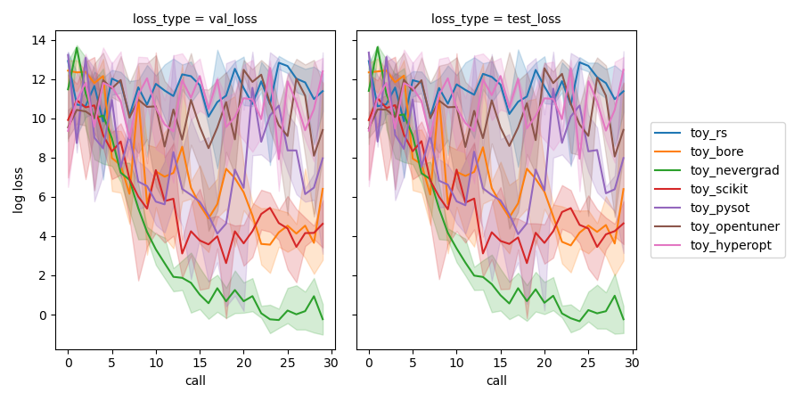
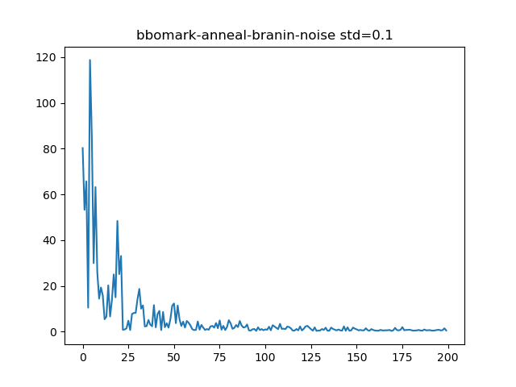
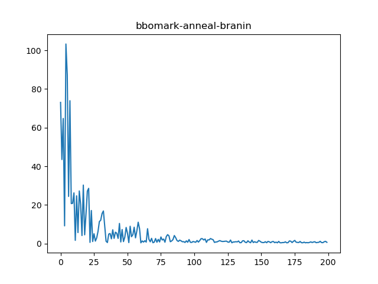

# bbomark

---

---

所有参数配置使用yaml格式，见`/cfgs/*.yaml`


## 测试

[实验记录点这里！](./实验记录.md)

跑benchmark实验运行示例：

```bash
PYTHONPATH='./' python ./example/demo.py
```

对实验结果分析：

```bash
PYTHONPATH='./' python ./example/analysis.py
```

[comment]: <> (![]&#40;./out/demo_res.png&#41;)



## TODO

- [ ] Transfer
  - [ ] TST-R
  - [ ] TAF
  - [ ] TAF(RGPE)
  - [ ] RMoGP
  - [ ] RGPE(mean)
  
- [ ] Optimizer
  - [x] BORE optimizer
  - [x] Anneal
  - [ ] DE
  - [ ] CMA
  - [ ] NSGA
  - [ ] Regularized EA
  - [ ] PBT
  
- [ ] condition config
- [ ] Parallelizing
- [x] Result visualize
- [ ] Reproductable ( Random state )
- [ ] log verbose

## 进度

### Anneal 
   
在 branin 黑盒函数测试


best_loss: 0.36538257770050925


best_loss: 0.398102262920645


best_loss: 0.4024387250287731

---