# bbomark

---

### 2021年10月3日

#### benchmark

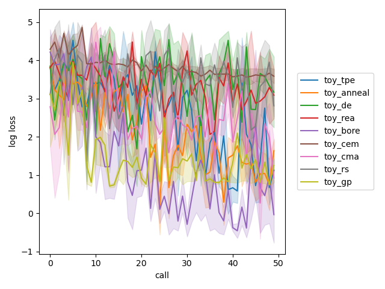

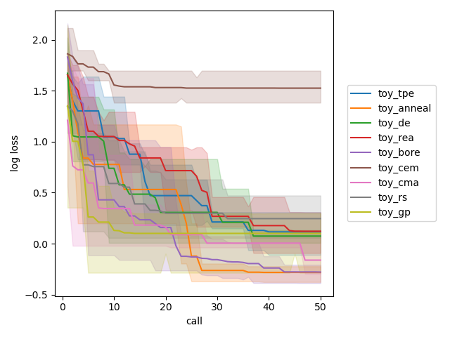


PBT(Population based training)

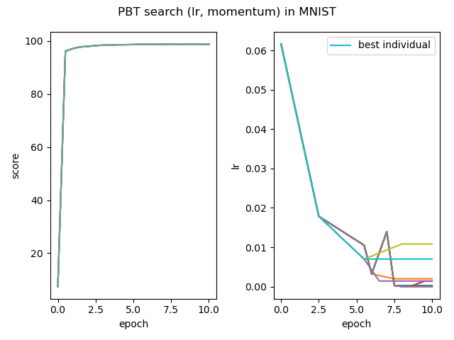

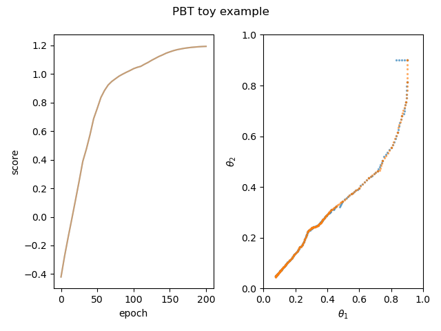

### 2021年9月26日

测试多目标黑盒函数ZDT1

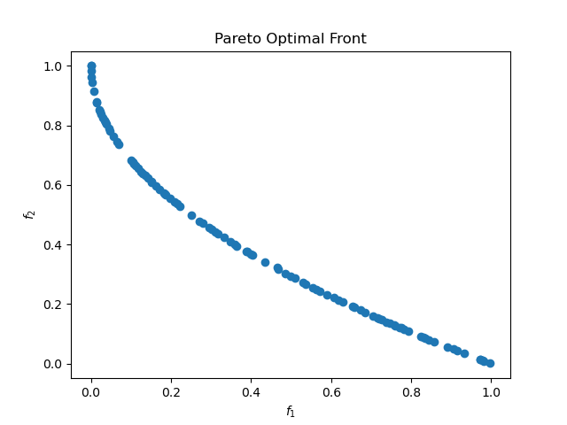

### 2021年9月15日

meta-data的label全部scale至0-1、cross validation结果

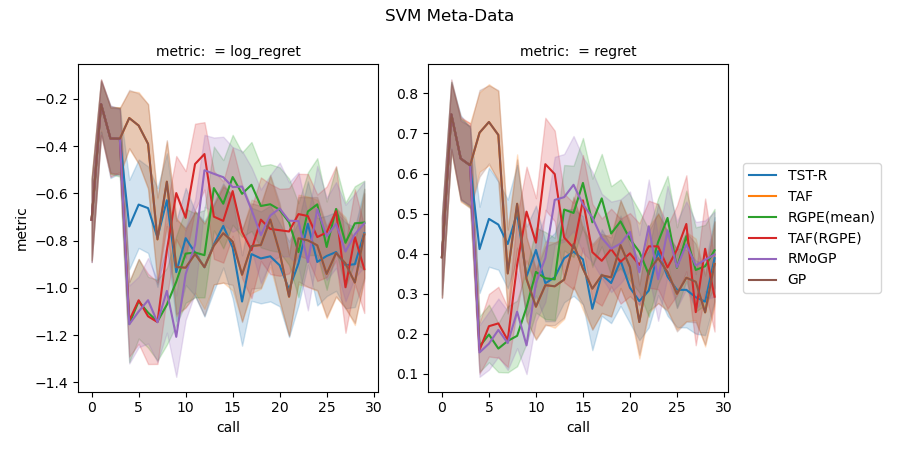

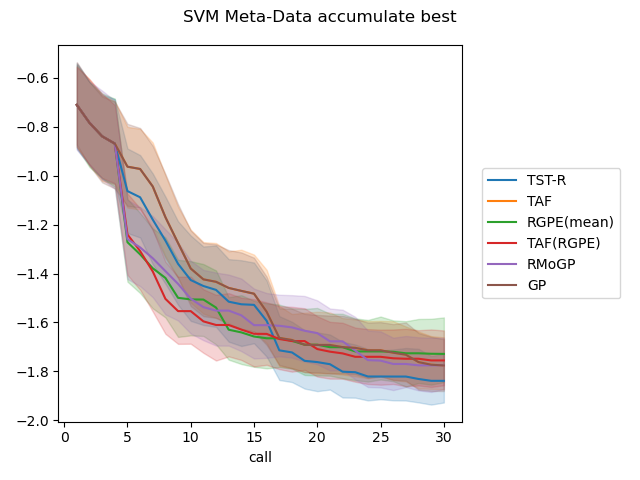

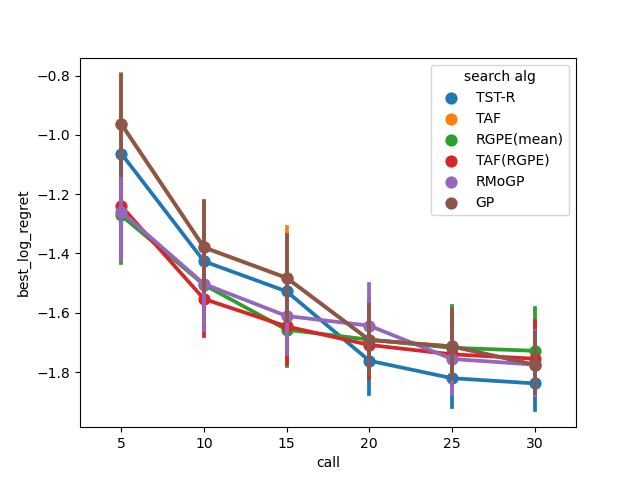


### 2021年9月10日

没有将task label scale至0-1

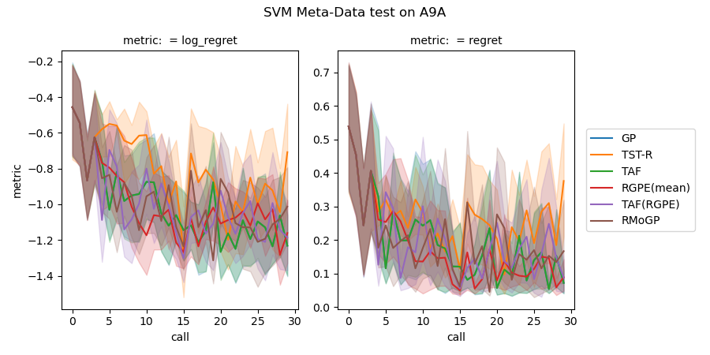

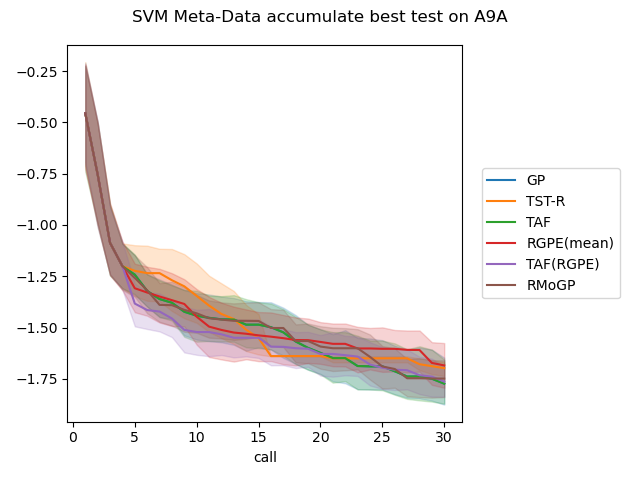

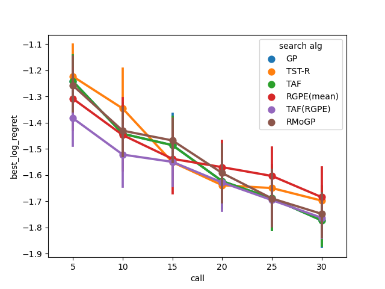

---

### RGPE (2021年9月5日)

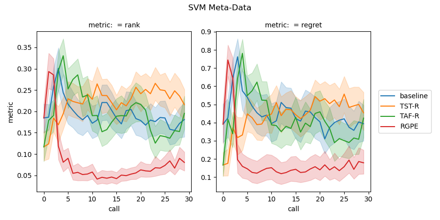

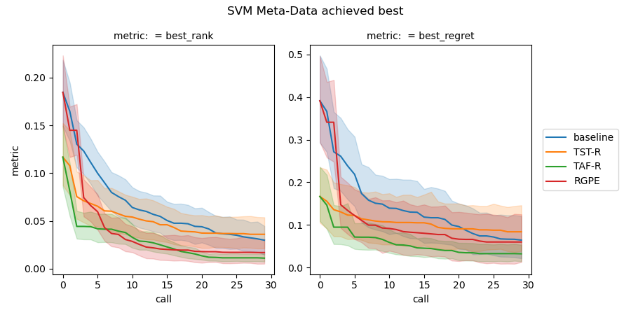

---

### TAF-R(2021年9月1日)

```bash
cd ${PROJECT_ROOT_PATH}
PYTHONPATH='./' python ./bbomark/example/test_tst2.py
PYTHONPATH='./' python ./bbomark/example/analysis_transfer.py
```


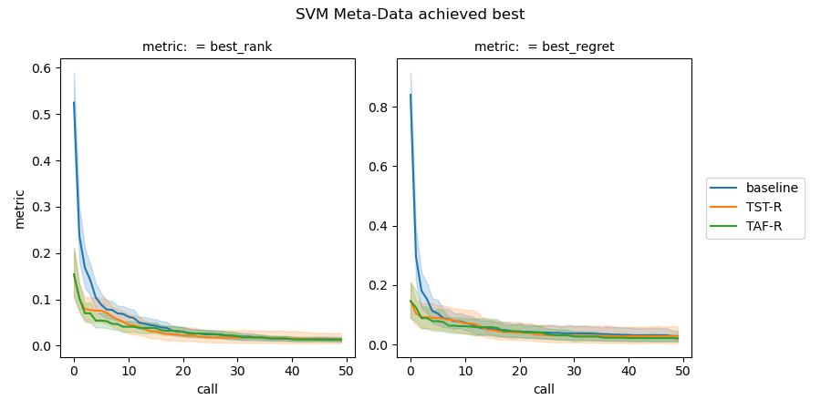

(2021年9月2号) *TST使用rho=0.75, TAF使用rho=0.75（高斯过程model使用GPy，SEkernel，输入3dim，去除类别变量）xi=0*：

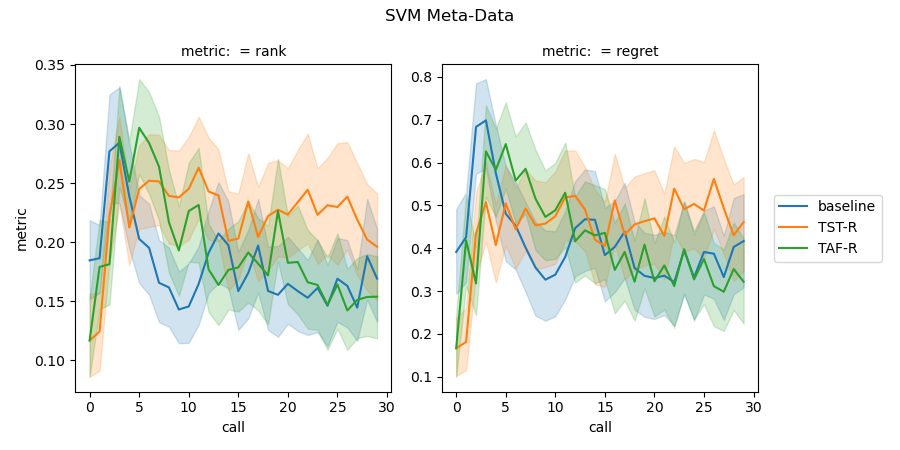

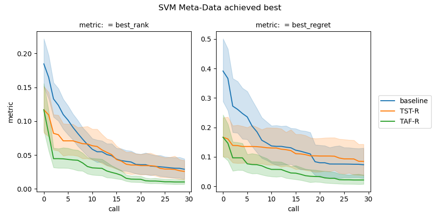

---

### TST-R (2021年8月29日)

测试运行：

```bash
cd ${PROJECT_ROOT_PATH}
PYTHONPATH='./' python ./bbomark/search_algorithm/transfer_tst_optimizer.py
```


Result:


Output:


```

----------
iter 1: 
0.810625
rank:  162
rank_best:  162
----------
iter 2: 
0.847886
rank:  5
rank_best:  5
----------
iter 3: 
0.845144
rank:  40
rank_best:  5
----------
iter 4: 
0.763538
rank:  250
rank_best:  5
----------
iter 5: 
0.770806
rank:  231
rank_best:  5
----------
iter 6: 
0.839083
rank:  95
rank_best:  5
----------
iter 7: 
0.844099
rank:  52
rank_best:  5
----------
iter 8: 
0.780428
rank:  168
rank_best:  5
----------
iter 9: 
0.842666
rank:  67
rank_best:  5
----------
iter 10: 
0.849217
rank:  1
rank_best:  1
----------
iter 11: 
0.821169
rank:  150
rank_best:  1
----------
iter 12: 
0.845532
rank:  33
rank_best:  1
----------
iter 13: 
0.846453
rank:  25
rank_best:  1
----------
iter 14: 
0.843587
rank:  59
rank_best:  1
----------
iter 15: 
0.847681
rank:  9
rank_best:  1
----------
iter 16: 
0.834169
rank:  126
rank_best:  1
----------
iter 17: 
0.847272
rank:  12
rank_best:  1
----------
iter 18: 
0.845429
rank:  36
rank_best:  1
----------
iter 19: 
0.847784
rank:  7
rank_best:  1
----------
iter 20: 
0.847272
rank:  12
rank_best:  1
----------
iter 21: 
0.846658
rank:  21
rank_best:  1
----------
iter 22: 
0.828744
rank:  138
rank_best:  1
----------
iter 23: 
0.84717
rank:  16
rank_best:  1
----------
iter 24: 
0.838264
rank:  103
rank_best:  1
----------
iter 25: 
0.837343
rank:  110
rank_best:  1
----------
iter 26: 
0.847989
rank:  4
rank_best:  1
----------
iter 27: 
0.847272
rank:  12
rank_best:  1
----------
iter 28: 
0.847886
rank:  5
rank_best:  1
----------
iter 29: 
0.846555
rank:  22
rank_best:  1
----------
iter 30: 
0.846555
rank:  22
rank_best:  1

```

---

### Anneal （2021年8月25日）

在 branin 黑盒函数测试


best_loss: 0.36538257770050925


best_loss: 0.398102262920645


best_loss: 0.4024387250287731

---

---

所有参数配置使用yaml格式，见`/cfgs/*.yaml`


## 测试

***详细实验记录后续存放在飞书***

[实验记录点这里！](./实验记录.md)

跑benchmark实验运行示例：

```bash
PYTHONPATH='./' python ./example/demo.py
```

对实验结果分析：

```bash
PYTHONPATH='./' python ./example/analysis.py
```

[comment]: <> "![]&#40;./out/demo_res.png&#41;"


## TODO

- [x] Transfer
  - [x] TST-R
  - [x] TAF
  - [x] TAF(RGPE)
  - [x] RMoGP
  - [x] RGPE(mean)
  
- [] Optimizer
  - [x] BORE optimizer
  - [x] Anneal
  - [x] DE
  - [x] CMA
  - [x] NSGA
  - [x] Regularized EA
  - [x] PBT
  - [ ] TuRBO
  
- [ ] condition config
- [ ] Parallelizing
- [x] Result visualize
- [x] Reproductable ( Random state )
- [ ] log verbose
- [ ] suggest duplicate detection

