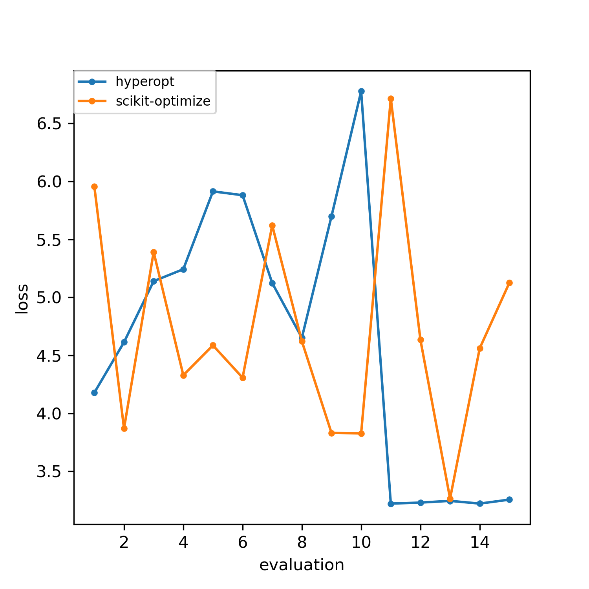

# bbomark

---

## 介绍

`data/`目录下存放处理数据有关代码

`model/`目录下存放模型

`optimizers/`目录下存放元优化器

`space/`目录下存放hyper-param空间变换相关代码

`utils/`目录下存放工具函数

`constants.py`存放所有常数定义

---

`model/config.py`内定义超参数及搜索范围

## 使用

> -c使用的model
> 
> -o使用的optimizer
> 
> -m使用的metric
> 
> -n给定的evaluation次数
> 
> -p每次suggest超参的数量
> 
> -his指定预加载观测的文件

## Feature

- 超参空间处理代码单独剥离，基于ConfigSpace（可利用conditional hyper-param），扩展warp、unwarp
- 提取bbo核心过程在`bbo.py`
- 抽象出Featurespace类，以适应不同optimizer的定义域

## 目标

方便拓展optimizer、space warp、model

## 测试

[comment]: <> (RandomSearch：)

[comment]: <> (```bash)

[comment]: <> (python ./bbomark/demo.py -c DT -d boston -o RandomSearch -u a98ee5903a9d5a5480d40ce9c81d7c86 -m mae -n 15 -p 1)

[comment]: <> (```)

[comment]: <> (Nevergrad优化器：)

[comment]: <> (```bash)

[comment]: <> (python ./bbomark/demo.py -c lasso -d boston -o Nevergrad-OnePlusOne -u a98ee5903a9d5a5480d40ce9c81d7c86 -m mae -n 50 -p 1)

[comment]: <> (```)

```bash
python ./bbomark/demo.py -c lasso -d boston -o RandomSearch HyperOpt Scikit-GP-LCB OpenTuner-GA-DE PySOT Nevergrad-OnePlusOne -u a98ee5903a9d5a5480d40ce9c81d7c86 -m mae -n 15 -p 2
```



## TODO

- [x] Transfer
- [ ] Parallelizing
- [x] Result visualize
- [ ] Reproductable ( Random state )
- [x] Extra data and model