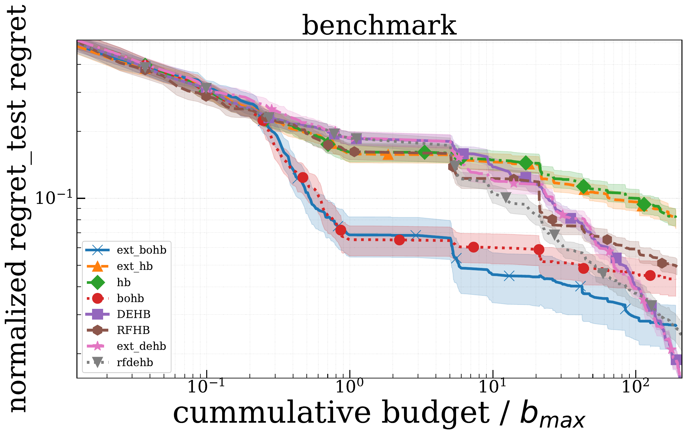

# Comparison

## Note

在开始对比测试前，需安装[DEHB](https://github.com/automl/DEHB)、[HpBandSter](https://github.com/automl/HpBandSter)

## Synthetic Function Optimization

- 测试函数：countingones(4d+4d)
- 测试优化器：BOHB、DEHB、hyperband
- Budget: [9, 729]
- Iteration num: 50
- Repeat num: 50

