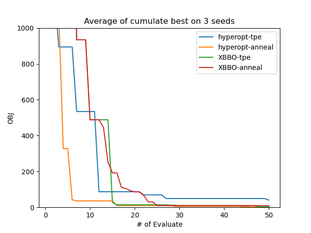

# Comparison with hyperopt

## Note

在开始对比测试前，需安装[hyperopt](https://github.com/hyperopt/hyperopt)

## Synthetic Function Optimization

- 测试函数：rosenbrock (2d)
- 测试优化器：Tree Parzen Estimator、Anneal
- 初始设计：Sobol design
- Budget: 50

- 测试函数：Branin (2d)
- Budget: 200
- Repeat num: 10

| Method           | Minimum       | Best minimum | Mean f_calls to min | Std f_calls to min | Fastest f_calls to min |
| ---------------- | ------------- | ------------ | ------------------- | ------------------ | ---------------------- |
| hyperopt(tpe)    | 0.487+/-0.051 | 0.422        | 126.8               | 45.814             | 66                     |
| hyperopt(atpe)   | 0.411+/-0.013 | 0.398        | 88.6                | 60.173             | 18                     |
| hyperopt(rand)   | 0.672+/-0.297 | 0.426        | 85.5                | 56.955             | 4                      |
| hyperopt(anneal) | 0.404+/-0.006 | 0.398        | 156.9               | 25.249             | 114                    |
| XBBO(tpe)        | 0.519+/-0.119 | 0.398        | 191.4               | 12.035             | 162                    |
| XBBO(anneal)     | 0.403+/-0.004 | 0.398        | 161.1               | 18.839             | 126                    |
| XBBO(rs)         | 0.684+/-0.248 | 0.399        | 110.4               | 60.511             | 17                     |