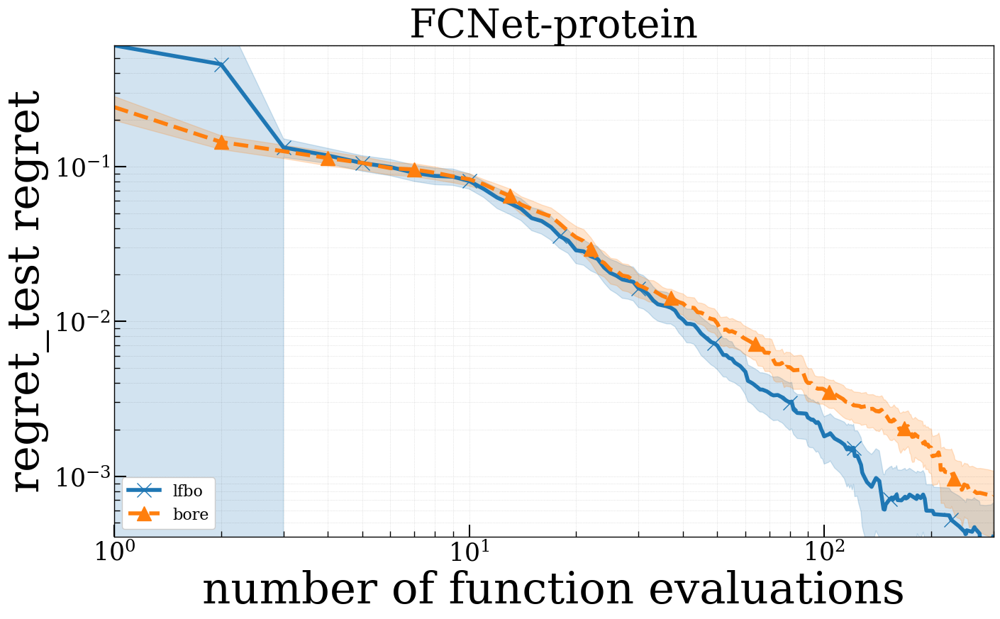

# LFBO


## Introduction

[A General Recipe for Likelihood-free Bayesian Optimization](https://arxiv.org/abs/2206.13035) [ICML2022]

[Official Repo](https://github.com/lfbo-ml/lfbo)

## Abstract

> The acquisition function, a critical component in Bayesian optimization (BO), can often be written as the expectation of a utility function under a surrogate model. However, to ensure that acquisition functions are tractable to optimize, restrictions must be placed on the surrogate model and utility function. To extend BO to a broader class of models and utilities, we propose likelihood-free BO (LFBO), an approach based on likelihood-free inference. LFBO directly models the acquisition function without having to separately perform inference with a probabilistic surrogate model. We show that computing the acquisition function in LFBO can be reduced to optimizing a weighted classification problem, where the weights correspond to the utility being chosen. By choosing the utility function for expected improvement (EI), LFBO outperforms various state-of-the-art black-box optimization methods on several real-world optimization problems. LFBO can also effectively leverage composite structures of the objective function, which further improves its regret by several orders of magnitude.

## Usage

E.g. `PYTHONPATH='./' python examples/LFBO/rosenbrock_lfbo.py`


## benchmark

Modify the following section of `comparison/xbbo_benchmark.py` :

```python
test_algs = ["lfbo"]
```
And run `PYTHONPATH='./' python comparison/xbbo_benchmark.py` in the command line.


### Comparison with BORE

Run `xbbo/run_benchmark.py`, where some of the changes are made to the code as follows:

```python
confs = {
        "./cfgs/bore.yaml": ["--mark", "bore"],
        "./cfgs/lfbo.yaml": ["--mark", "lfbo"]}
general_opts = ["OPTM.kwargs.classify", "xgb", "OPTM.kwargs.num_starts", "0", "TEST_PROBLEM.name", "FCNet"]

Analyse('./exp', benchmark='FCNet', marks=marks, legend_size=16)
```
```python
confs = {
        "./cfgs/bore.yaml": ["--mark", "bore"],
        "./cfgs/lfbo.yaml": ["--mark", "lfbo"]}
general_opts = ["OPTM.kwargs.classify", "xgb", "OPTM.kwargs.num_starts", "0", "TEST_PROBLEM.name", "Rosenbrock"]

Analyse('./exp', benchmark='Rosenbrock', marks=marks, legend_size=16)
```

## Results


### Branin

|   Method   |    Minimum    | Best minimum | Mean f_calls to min | Std f_calls to min | Fastest f_calls to min |
| :--------: | :-----------: | :----------: | :-----------------: | :----------------: | :--------------------: |
| XBBO(lfbo) | 0.417+/-0.021 |    0.398     |        85.9         |       60.69        |           27           |


### FCNet benchmark:



### rosenbrock benchmark:

