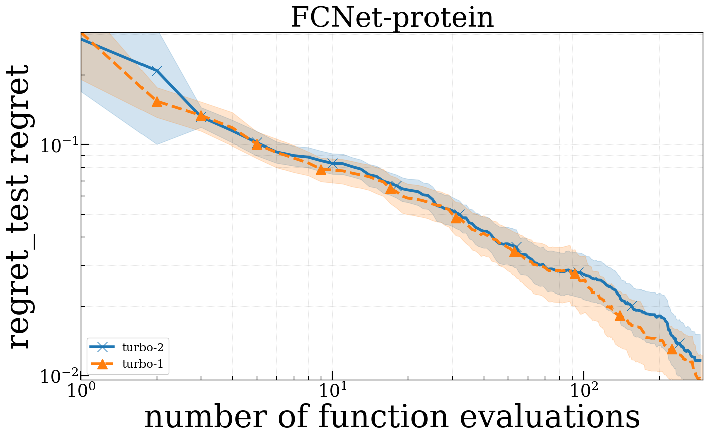
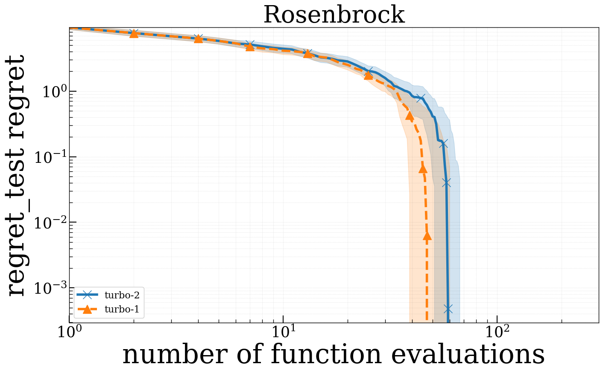

# TuRBO


## Introduction

[Scalable Global Optimization via Local Bayesian Optimization](https://arxiv.org/abs/1910.01739)

## Abstract

> Bayesian optimization has recently emerged as a popular method for the sample-efficient optimization of expensive black-box functions. However, the application to high-dimensional problems with several thousand observations remains challenging, and on difficult problems Bayesian optimization is often not competitive with other paradigms. In this paper we take the view that this is due to the implicit homogeneity of the global probabilistic models and an overemphasized exploration that results from global acquisition. This motivates the design of a local probabilistic approach for global optimization of large-scale high-dimensional problems. We propose the 𝚃𝚞𝚁𝙱𝙾 algorithm that fits a collection of local models and performs a principled global allocation of samples across these models via an implicit bandit approach. A comprehensive evaluation demonstrates that 𝚃𝚞𝚁𝙱𝙾 outperforms state-of-the-art methods from machine learning and operations research on problems spanning reinforcement learning, robotics, and the natural sciences.

## Usage

E.g. `PYTHONPATH='./' python examples/TuRBO/rosenbrock_turbo.py`


## benchmark

Modify the following section of `comparison/xbbo_benchmark.py` :

```python
test_algs = ["turbo-1","turbo-2"]
```
And run `PYTHONPATH='./' python comparison/xbbo_benchmark.py` in the command line.

### Visualize

Run `xbbo/run_benchmark.py`, where some of the changes are made to the code as follows:

```python
confs = {
        "./cfgs/turbo-1.yaml": ["--mark", "turbo-1"],
        "./cfgs/turbo-2.yaml": ["--mark", "turbo-2"]}
general_opts = ["TEST_PROBLEM.name", "FCNet"]

Analyse('./exp', benchmark='FCNet', marks=marks, legend_size=16)
```
```python
confs = {
        "./cfgs/turbo-1.yaml": ["--mark", "turbo-1"],
        "./cfgs/turbo-2.yaml": ["--mark", "turbo-2"]}
general_opts = ["TEST_PROBLEM.name", "Rosenbrock"]

Analyse('./exp', benchmark='Rosenbrock', marks=marks, legend_size=16)
```

## Results


### Branin

|   Method  |    Minimum    | Best minimum | Mean f_calls to min | Std f_calls to min | Fastest f_calls to min |
| :--------: | :-----------: | :----------: | :-----------------: | :----------------: | :--------------------: |
| XBBO(turbo-1) | 0.398+/-0.000 |    0.398     |         91.0        |       41.153       |           44           |
| XBBO(turbo-2) | 0.398+/-0.000 |    0.398     |         98.6        |       35.688       |           62           |

### FCNet benchmark:



### rosenbrock benchmark:

