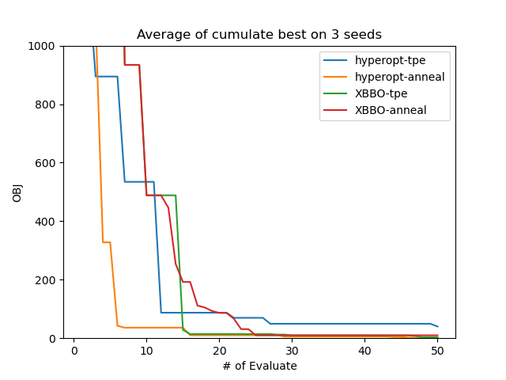

# Comparison

## Note

在开始对比测试前，需安装[hyperopt](https://github.com/hyperopt/hyperopt)

## Synthetic Function Optimization

- 测试函数：rosenbrock (2d)
- 测试优化器：Tree Parzen Estimator、Anneal
- 初始设计：Sobol design
- Budget: 50

