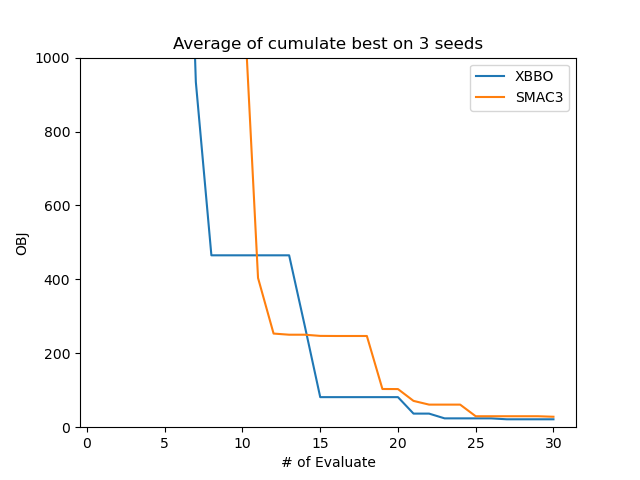
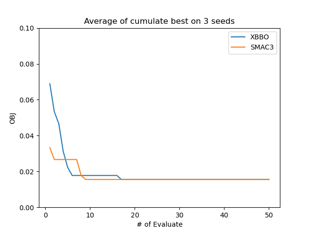

# Comparison

## Note

在开始对比测试前，需安装[SMAC3](https://github.com/automl/SMAC3)

## Synthetic Function Optimization

- 测试函数：rosenbrock (2d)
- 测试优化器：Bayesian optimization with Gaussian process
- 代理模型：Gaussian Process
- 采集函数：Expect Improvement (EI)
- 采集函数优化方式：random search + local search
- 初始设计：Sobol design

## SVM Hyperparameters Optimization

- 测试函数：SVM超参
- 测试优化器：Bayesian optimization with Probability Random Forest
- 代理模型：Probability Random Forest
- 采集函数：Expect Improvement (EI)
- 采集函数优化方式：random search + local search
- 初始设计：Sobol design

- 测试函数：Branin (2d)
- Budget: 200
- Repeat num: 10

| Method      | Minimum         | Best minimum | Mean f_calls to min | Std f_calls to min | Fastest f_calls to min |
| ----------- | --------------- | ------------ | ------------------- | ------------------ | ---------------------- |
| SMAC3(gp)   | 0.398+/-0.000   | 0.398        | 147.5               | 25.816             | 117                    |
| XBBO(bo-gp) | 0.398+/-0.000 | 0.398        | 42.0                | 5.0398             | 30                     |